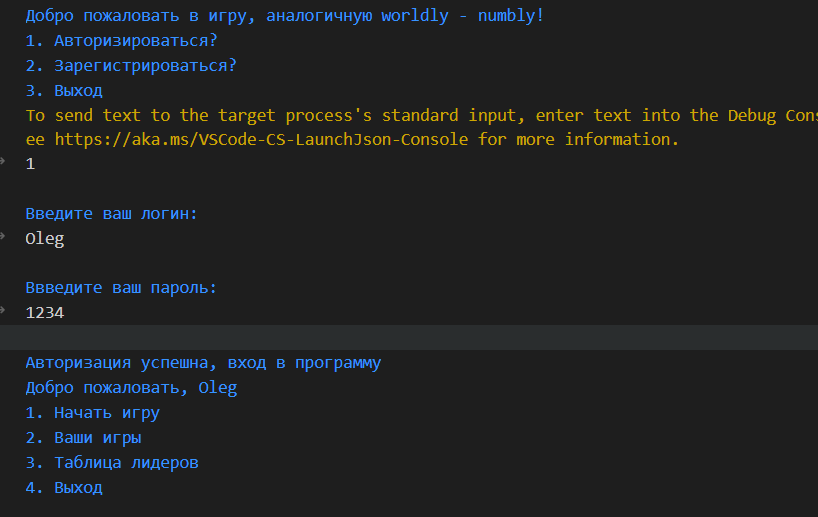

# Code for lab on TiOPO
This code show us the game named "Numbly". But this lab in main meaning teach us how we can work with Git and GitHub


````C#
static int GenNum()
        {
            Random random = new Random();
            int number = 0;

            while (true)
            {
                number = random.Next(1000, 10000);
                char[] digits = number.ToString().ToCharArray();
                if (digits.Length == 4 && digits.Distinct().Count() == 4)
                {
                    break;
                }
            }

            return number;
        }
````
### Photo of menu in my program:   

